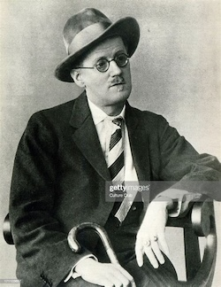

# AreTheyAnLLM?

A toolkit for sniffing out large-language-model output—whether it’s typed or spoken—and ranking it realtive to other possible LLMs.

---

## 🚀 What’s Inside

- **Text Detective**:  
  Feed any snippet to `isitllm` and get back a score (0–100%) of “LLM-ness.”

- **Voice Inspector**:  
  Speak into your mic; our realtime client streams audio to OpenAI’s `gpt-4o-mini-transcribe`, logs the transcript, then scores it in chunks.

- **Transcript Log**:  
  All your deltas (Δ) and completions (✔) land in `transcript.txt` for post-mortem reading.

- **KITT Scale Benchmarks**:  
  1. **Knight Industries Two Thousand** (KITT, _Knight Rider_ Trans Am): **6.25%**
     

  2. **Al Gore Acceptance Speech**: **17.71%**
     

  3. **Elizabeth Holmes Bio Excerpt**: **27.42%**
     

  4. **James Joyce, *Finnegans Wake* (“riverrun”…)**: **2.45%**
     


---

## 📖 Getting Started

1. **Clone** this repo
   ```bash
   git clone https://github.com/your-org/AreTheyAnLLM.git   
   cd AreTheyAnLLM
   ```

2. **Install dependencies**
   ```bash
   pip install -r requirements.txt
   ```

3. **Configure**
   Create a `.env` file containing:
   ```
   OPENAI_API_KEY=...
   ```

### 🛠️ Usage

**Text mode**
```python
python isitllm.py
```

**Voice mode**
```bash
python RealtimeLLMCheck.py #Allow access to your mic and start talking!
```
Speak for 60 seconds (or press ENTER to stop early). Check `transcript.txt` for the full log and watch your score roll in and plot at kitt_scale_plot.png.

### 📜 License

MIT © 2025 Scott Reed


